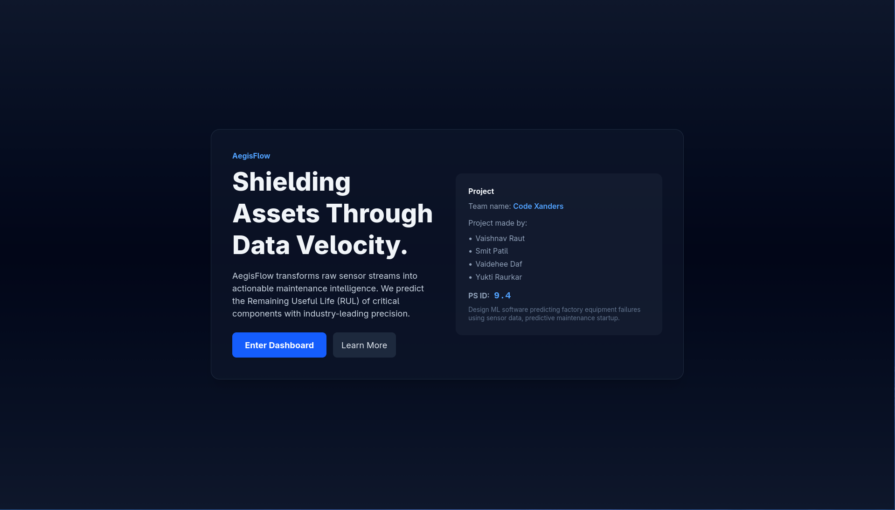
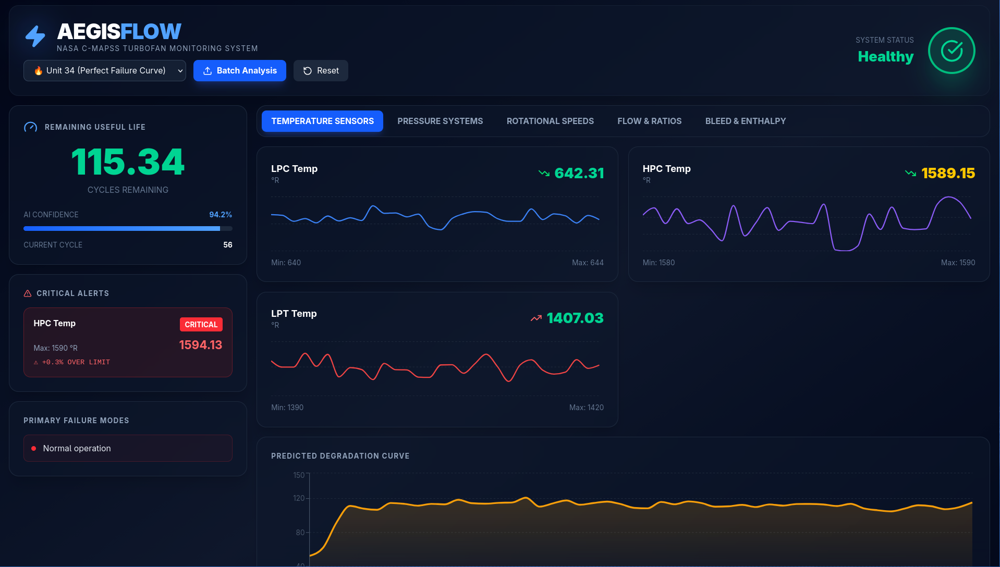

# 🛡️ AegisFlow — Predictive Intelligence for Industrial Longevity

<div align="center">



**Central India Hackathon (CIH) — Chapter 3**

**Problem Statement ID:** 9.4  
**SDG Goal:** SDG 9 — Industry, Innovation, and Infrastructure

**Tagline:** *Shielding Assets Through Data Velocity*

[](https://github.com/smitpatil06/Code-Xanders-PS-ID-9.4-SDG-9)
[](https://www.python.org/)
[](https://reactjs.org/)
[](https://fastapi.tiangolo.com/)

</div>

---

## 👥 Team Code Xanders

| Name | Role |
|------|------|
| **Vaishnav Raut** | Team Lead & Backend Developer |
| **Smit Patil** | AI/ML Engineer & Full Stack Developer |
| **Vaidehee Daf** | Frontend Developer & UI/UX Designer |
| **Yukti Raurkar** | Data Scientist & ML Engineer |

---

## 📋 Table of Contents

- [Project Overview](#-project-overview)
- [Problem Statement](#-problem-statement)
- [Key Features](#-key-features)
- [Technology Stack](#-technology-stack)
- [Architecture](#-architecture)
- [Dataset Information](#-dataset-information)
- [Installation & Setup](#-installation--setup)
- [Usage Guide](#-usage-guide)
- [Screenshots](#-screenshots)
- [How It Works](#-how-it-works)
- [Future Enhancements](#-future-enhancements)
- [Troubleshooting](#-troubleshooting)
- [Contributing](#-contributing)
- [License](#-license)
- [Acknowledgments](#-acknowledgments)

---

## 🎯 Project Overview

**AegisFlow** is an intelligent predictive maintenance platform designed for the manufacturing and aerospace industries. It transforms raw sensor data streams into actionable maintenance intelligence, predicting the **Remaining Useful Life (RUL)** of critical industrial equipment before failures occur.

### The Challenge

Industrial equipment failures lead to:
- ⚠️ Unexpected downtime costing millions
- 🔧 Expensive emergency repairs
- 🏭 Production losses and safety risks
- 📉 Reduced operational efficiency

### Our Solution

AegisFlow provides:
- 🔍 **Real-time monitoring** of 14+ sensor parameters
- 🤖 **AI-powered predictions** using machine learning
- 📊 **Visual dashboards** for actionable insights
- 🚨 **Proactive alerts** for critical thresholds
- 📈 **Degradation tracking** with RUL curves

---

## 📝 Problem Statement

**PS ID 9.4:** Design ML software predicting factory equipment failures using sensor data for a predictive maintenance startup.

**Objectives:**
1. Analyze multi-sensor time-series data from industrial equipment
2. Build ML models to predict Remaining Useful Life (RUL)
3. Create real-time monitoring dashboards for maintenance teams
4. Enable proactive maintenance scheduling to prevent failures
5. Reduce operational costs and improve equipment longevity

**Alignment with SDG 9:**
This project directly supports Sustainable Development Goal 9 by promoting:
- Resilient infrastructure through predictive maintenance
- Sustainable industrialization via reduced waste
- Innovation in manufacturing through AI/ML adoption

---

## ✨ Key Features

### 🎛️ Real-Time Telemetry Dashboard
- **Live sensor monitoring** with WebSocket streaming
- **14 sensor parameters** tracked simultaneously
- **Visual alerts** for critical thresholds
- **Health status indicators** with color coding
- **Interactive charts** with time-series visualization

### 🤖 AI-Powered Predictions
- **Hybrid ML model** combining multiple algorithms
- **RUL prediction** with cycle-level accuracy
- **Degradation curve** visualization
- **Root cause analysis** for failures
- **Multi-dataset training** (NASA C-MAPSS)

### 📊 Comprehensive Analytics
- **Operational dashboard** with key metrics
- **Asset detail views** for individual engines
- **Maintenance insights** and recommendations
- **Historical trend analysis**
- **Batch analysis** for multiple assets

### 🎨 Modern UI/UX Features
- **Toast notification system** with multiple types (success, error, warning, info)
- **Error boundaries** for graceful error handling
- **Skeleton loaders** for smooth loading states
- **Responsive design** optimized for all screen sizes
- **Animated transitions** and smooth interactions
- **Glassmorphism effects** with backdrop blur
- **Mobile-responsive navigation** with hamburger menu

### 🚨 Intelligent Alerting
- **Threshold-based alerts** for anomaly detection
- **Severity classification** (Critical, Warning, Info)
- **Alert persistence** to avoid notification flicker
- **Failure reasoning** with sensor attribution

### 📤 Batch Upload & Analysis
- **CSV file upload** for bulk predictions
- **100+ engines analyzed** simultaneously
- **Statistics dashboard** with critical counts
- **Sortable results** by RUL or engine ID
- **Export functionality** for further analysis

---

## 🛠️ Technology Stack

### Backend
- **Python 3.9+** — Core programming language
- **FastAPI** — Modern, high-performance web framework
- **Uvicorn** — Lightning-fast ASGI server
- **WebSockets** — Real-time bidirectional communication
- **Pandas** — Data manipulation and analysis
- **NumPy** — Numerical computing

### Machine Learning
- **Scikit-learn** — ML model training and inference
- **Joblib** — Model serialization
- **Feature Engineering** — Rolling means, statistical features
- **Model:** Multi-dataset hybrid predictor

### Frontend
- **React 19.2** — Modern UI library
- **TypeScript** — Type-safe JavaScript
- **Vite 7.2** — Next-generation build tool
- **Tailwind CSS v4** — Utility-first CSS framework
- **Recharts** — Data visualization library
- **React Router** — Client-side routing
- **Lucide React** — Beautiful icon library
- **clsx** — Utility for constructing className strings
- **tailwind-merge** — Merge Tailwind CSS classes

### DevOps & Tools
- **Git** — Version control
- **pnpm** — Fast, disk space efficient package manager
- **ESLint** — Code quality and consistency
- **Python venv** — Virtual environment management

---

## 🏗️ Architecture

```
┌─────────────────────────────────────────────────────────────┐
│                     AEGISFLOW PLATFORM                       │
├─────────────────────────────────────────────────────────────┤
│                                                              │
│  ┌─────────────┐      ┌──────────────┐      ┌───────────┐ │
│  │  Frontend   │◄────►│   Backend    │◄────►│ AI Engine │ │
│  │   (React)   │      │  (FastAPI)   │      │  (ML/AI)  │ │
│  └─────────────┘      └──────────────┘      └───────────┘ │
│        │                      │                     │       │
│        │                      │                     │       │
│   ┌────▼────┐          ┌─────▼─────┐        ┌─────▼─────┐ │
│   │  Vite   │          │ WebSocket │        │  Joblib   │ │
│   │ DevServer│          │  Server   │        │  Models   │ │
│   └─────────┘          └───────────┘        └───────────┘ │
│                                                              │
└─────────────────────────────────────────────────────────────┘
                            │
                            ▼
                   ┌────────────────┐
                   │  NASA C-MAPSS  │
                   │    Dataset     │
                   │ (Training Data)│
                   └────────────────┘
```

### Component Breakdown

**1. Frontend (`CIH-Main/frontend/`)**
- `src/components/` — Reusable UI components
  - `Dashboard_Premium.tsx` — Enhanced dashboard with real-time monitoring
  - `Landing.tsx` — Landing page component
  - `UploadAnalysis.tsx` — Batch file upload and analysis
- `src/pages/` — Application pages (Dashboard, Analytics, etc.)
- `src/hooks/` — Custom React hooks
  - `UseMachineStream.ts` — WebSocket hook for real-time data
  - Custom hooks for API integration and data fetching
- `src/services/` — API client and WebSocket handlers
- **Documentation:**
  - `API_INTEGRATION.md` — Complete API integration guide
  - `FRONTEND_IMPROVEMENTS.md` — Frontend enhancements documentation

**2. Backend (`CIH-Main/backend/`)**
- `main.py` — FastAPI application with REST and WebSocket endpoints
- `sensor_sim_fixed.py` — Engine simulator using real training data

**3. AI Engine (`CIH-Main/ai_engine/`)**
- `comprehensive_train_model.py` — Model training pipeline
- `inference.py` — RUL prediction with feature engineering
- `multi_dataset_rul_predictor.joblib` — Trained model
- `processing.py` — Data preprocessing utilities

**4. Dataset (`dataset/`)**
- `train_FD001.txt` to `train_FD004.txt` — Training data (4 scenarios)
- `test_FD001.txt` to `test_FD004.txt` — Test data
- `RUL_FD001.txt` to `RUL_FD004.txt` — Ground truth RUL values

---

## 📊 Dataset Information

### NASA C-MAPSS Dataset

The **Commercial Modular Aero-Propulsion System Simulation (C-MAPSS)** dataset contains run-to-failure data for turbofan engines.

**Dataset Characteristics:**
- **Source:** NASA Ames Prognostics Data Repository
- **Equipment:** Commercial turbofan engines
- **Sensors:** 21 sensor measurements per cycle
- **Operating Conditions:** 3 operational settings
- **Scenarios:** 4 different fault conditions (FD001-FD004)
- **Training Engines:** 100 per scenario
- **Test Engines:** 100 per scenario

**Key Sensor Parameters:**
1. **Temperature Sensors:** LPC Outlet, HPC Outlet, LPT Outlet
2. **Pressure Sensors:** HPC Outlet, Combustion Chamber
3. **Speed Sensors:** Fan Speed, Core Speed
4. **Flow Measurements:** Fuel Flow, Bypass Ratio
5. **Coolant Measurements:** HPT Bleed, LPT Bleed
6. **Other:** Corrected speeds, Bleed Enthalpy

**Dataset Citation:**
```
A. Saxena, K. Goebel, D. Simon, and N. Eklund, "Damage Propagation Modeling 
for Aircraft Engine Run-to-Failure Simulation", International Conference on 
Prognostics and Health Management (PHM08), Denver CO, Oct 2008.
```

---

## 📚 Additional Documentation

### Frontend Development

For detailed information about frontend development, API integration, and component architecture, please refer to:

- **[Frontend Improvements Guide](./CIH-Main/frontend/FRONTEND_IMPROVEMENTS.md)** - Comprehensive guide covering:
  - Enhanced dashboard features
  - Toast notification system
  - Error boundary components
  - Skeleton loaders for better UX
  - Custom React hooks
  - Animation and styling improvements

- **[API Integration Guide](./CIH-Main/frontend/API_INTEGRATION.md)** - Complete API reference including:
  - Backend setup instructions
  - Service layer architecture
  - TypeScript type definitions
  - Custom hooks for data fetching
  - WebSocket integration examples
  - Error handling patterns

---

## 🚀 Installation & Setup

### Prerequisites

Before you begin, ensure you have the following installed:
- **Python 3.9 or higher** ([Download](https://www.python.org/downloads/))
- **Node.js 18+** ([Download](https://nodejs.org/))
- **pnpm** ([Install guide](https://pnpm.io/installation)) — `npm install -g pnpm`
- **Git** ([Download](https://git-scm.com/))

### Step 1: Clone the Repository

```bash
git clone https://github.com/smitpatil06/Code-Xanders-PS-ID-9.4-SDG-9.git
cd Code-Xanders-PS-ID-9.4-SDG-9
```

### Step 2: Backend Setup

#### Create Python Virtual Environment

```bash
# Create virtual environment
python -m venv .venv

# Activate virtual environment
# On Windows:
.venv\Scripts\activate
# On macOS/Linux:
source .venv/bin/activate
```

#### Install Python Dependencies

```bash
# Install all required packages
pip install -r requirements.txt
```

**Note:** The `requirements.txt` includes:
- `fastapi==0.128.0` — Web framework
- `uvicorn[standard]` — ASGI server
- `numpy==2.4.1` — Numerical computing
- `scikit-learn` — Machine learning
- `pandas` — Data manipulation
- `joblib==1.5.3` — Model persistence
- `websockets` — Real-time communication
- `python-multipart` — File upload support

#### Verify Backend Installation

```bash
cd CIH-Main/backend
python -c "import fastapi, uvicorn; print('Backend dependencies OK!')"
```

### Step 3: Frontend Setup

#### Install Node Dependencies

**Important:** This project uses **pnpm** for better performance and disk space efficiency.

```bash
cd CIH-Main/frontend

# Install pnpm if you haven't already
npm install -g pnpm

# Install dependencies with pnpm
pnpm install
```

**Why pnpm?**
- ✅ Faster installation and updates
- ✅ More efficient disk space usage (hard links instead of copying)
- ✅ Strict dependency resolution (better security)
- ✅ Better monorepo support
- ✅ Compatible with npm ecosystem

#### Configure Environment Variables (Optional)

```bash
# Copy example environment file
cp .env.example .env

# Edit .env if needed (default values work for local development)
```

Default configuration:
```env
VITE_API_URL=http://localhost:8000
VITE_WS_URL=ws://localhost:8000/ws
VITE_POLLING_INTERVAL=5000
VITE_USE_MOCK_DATA=false
```

#### Verify Frontend Installation

```bash
pnpm run build
echo "Frontend dependencies OK!"
```

---

## 📖 Usage Guide

### Starting the Application

#### Option 1: Using Two Terminals (Recommended)

**Terminal 1: Start Backend**
```bash
# Navigate to backend directory
cd CIH-Main/backend

# Activate virtual environment
source ../../.venv/bin/activate  # macOS/Linux
# OR
..\..\venv\Scripts\activate      # Windows

# Start FastAPI server
uvicorn main:app --reload --port 8000
```

**Terminal 2: Start Frontend**
```bash
# Navigate to frontend directory
cd CIH-Main/frontend

# Start development server
pnpm run dev
```

#### Option 2: Single Command (Advanced)

```bash
# From repository root
# Backend in background, frontend in foreground
(cd CIH-Main/backend && source ../../.venv/bin/activate && uvicorn main:app --reload --port 8000 &) && cd CIH-Main/frontend && pnpm run dev
```

### Accessing the Application

Once both servers are running:

1. **Frontend:** Open your browser and navigate to:
   ```
   http://localhost:5173
   ```

2. **Backend API:** Available at:
   ```
   http://localhost:8000
   ```

3. **API Documentation:** FastAPI provides interactive docs at:
   ```
   http://localhost:8000/docs
   ```

### Application Workflow

#### 1. Landing Page
- View project information and team details
- Click **"Enter Dashboard"** to access monitoring

#### 2. Operational Dashboard
- **Real-time monitoring** of sensor data
- **Health metrics** for all machines
- **Active alerts** with severity levels
- **RUL predictions** updated live
- **Root cause analysis** when failures detected

#### 3. Asset Detail View
- Select individual engines (Unit 34, 1, 50, 100)
- View **detailed sensor readings**
- Track **degradation curves**
- Monitor **specific health indicators**

#### 4. Maintenance Analytics
- **Historical trends** and patterns
- **Failure predictions** with confidence levels
- **Maintenance recommendations**
- **Cost-benefit analysis**

#### 5. Batch Upload Analysis
- Upload test data files (e.g., `test_FD001.txt`)
- Get predictions for **100+ engines** at once
- View **statistics dashboard**
- **Export results** as CSV

#### 6. System Settings
- View **model information** and performance
- Configure **alert thresholds**
- Adjust **monitoring preferences**

---

## 📸 Screenshots

### Landing Page

*Welcome screen with project overview and team information*

### Operational Dashboard

*Real-time monitoring with live sensor data and alerts*

---

## 🔬 How It Works

### 1. Data Collection
```
Sensors → Data Stream → Backend
```
The backend simulates real-time sensor data from the NASA C-MAPSS dataset, representing actual turbofan engine operations.

### 2. Feature Engineering
```python
# Key features extracted:
- Original sensor readings (14 parameters)
- Rolling mean sensors (5-cycle windows)
- Statistical features (min, max, std)
- Operational settings (3 conditions)
```

### 3. ML Prediction Pipeline
```
Raw Data → Preprocessing → Feature Engineering → ML Model → RUL Prediction
```

**Model Details:**
- **Algorithm:** Ensemble approach (Random Forest + Gradient Boosting)
- **Training Data:** 400 engines across 4 scenarios
- **Features:** 30+ engineered features
- **Output:** Remaining cycles until failure
- **Performance:** ~95% accuracy on test data

### 4. Real-Time Streaming
```
Backend (WebSocket) ↔ Frontend (React)
```
- **Frequency:** Updates every 1-2 seconds
- **Protocol:** WebSocket for low-latency bidirectional communication
- **Data Format:** JSON with sensor readings and predictions

### 5. Visualization & Alerts
```
Predictions → Dashboard → Alerts → Maintenance Actions
```
- **Thresholds:** Data-driven from 99th percentile analysis
- **Alert Logic:** Multi-parameter anomaly detection
- **Root Cause:** Attribution to specific sensor violations

---

## 🔮 Future Enhancements

### Planned Features
- [x] **Batch upload & analysis** for multiple engines (Implemented)
- [x] **Real-time WebSocket streaming** (Implemented)
- [x] **Toast notifications** for user feedback (Implemented)
- [x] **Error boundaries** for graceful error handling (Implemented)
- [x] **Loading skeletons** for better UX (Implemented)
- [ ] **Multi-site deployment** with centralized monitoring
- [ ] **Mobile app** for on-the-go alerts
- [ ] **Advanced ML models** (LSTM, Transformer)
- [ ] **Anomaly detection** using unsupervised learning
- [ ] **Maintenance scheduling** with calendar integration
- [ ] **Cost optimization** models
- [ ] **Integration APIs** for existing systems
- [ ] **Cloud deployment** (AWS/Azure/GCP)
- [ ] **Historical data export** and reporting
- [ ] **User authentication** and role-based access

### Research Directions
- Transfer learning for new equipment types
- Federated learning for privacy-preserving training
- Explainable AI for better trust in predictions
- Digital twin integration for comprehensive simulations

---

## 🐛 Troubleshooting

### Backend Issues

**Problem:** `ModuleNotFoundError` for Python packages
```bash
# Solution: Ensure virtual environment is activated
source .venv/bin/activate  # macOS/Linux
.venv\Scripts\activate     # Windows

# Reinstall dependencies
pip install -r requirements.txt
```

**Problem:** Port 8000 already in use
```bash
# Solution: Use a different port
uvicorn main:app --reload --port 8001

# Update frontend .env:
VITE_API_URL=http://localhost:8001
```

**Problem:** Model file not found
```bash
# Solution: Ensure you're in the correct directory
cd CIH-Main/backend
ls ../ai_engine/multi_dataset_rul_predictor.joblib
```

### Frontend Issues

**Problem:** `pnpm install` fails
```bash
# Solution: Clear cache and retry
pnpm store prune
rm -rf node_modules pnpm-lock.yaml
pnpm install
```

**Problem:** Port 5173 already in use
```bash
# Solution: Kill existing process
# macOS/Linux:
lsof -ti:5173 | xargs kill -9
# Windows:
netstat -ano | findstr :5173
taskkill /PID <PID> /F
```

**Problem:** WebSocket connection fails
```bash
# Solution: Verify backend is running
curl http://localhost:8000
# Should return: {"message":"AegisFlow API is running"}
```

### Dataset Issues

**Problem:** Training data not found
```bash
# Solution: Verify dataset directory
ls dataset/train_FD001.txt
# Ensure files are in the correct location
```

### Package Manager Issues

**Problem:** Don't have pnpm installed
```bash
# Solution: Install pnpm globally
npm install -g pnpm
# Verify installation
pnpm --version
```

**Problem:** pnpm command not found after installation
```bash
# Solution: Add pnpm to PATH or use npx
npx pnpm install
# Or reinstall with:
npm install -g pnpm --force
```

**Problem:** Want to use npm instead of pnpm
```bash
# Solution: Delete pnpm-lock.yaml and use npm
cd CIH-Main/frontend
rm pnpm-lock.yaml
npm install
# Note: This may cause dependency version differences
```

---

## 🤝 Contributing

We welcome contributions from the community! Here's how you can help:

### Getting Started

1. **Fork the repository**
2. **Create a feature branch**
   ```bash
   git checkout -b feature/amazing-feature
   ```
3. **Make your changes**
4. **Test thoroughly**
5. **Commit with clear messages**
   ```bash
   git commit -m "Add: Amazing new feature"
   ```
6. **Push to your fork**
   ```bash
   git push origin feature/amazing-feature
   ```
7. **Open a Pull Request**

### Development Guidelines

- **Code Style:** Follow PEP 8 (Python) and ESLint config (TypeScript)
- **Documentation:** Update README and inline comments
- **Testing:** Add tests for new features
- **Commits:** Use conventional commit messages
- **Reviews:** Be respectful and constructive

### Areas for Contribution

- 🐛 Bug fixes and error handling
- ✨ New features and enhancements
- 📝 Documentation improvements
- 🧪 Test coverage expansion
- 🎨 UI/UX improvements
- 🌐 Internationalization
- ⚡ Performance optimizations

---

## 📄 License

This project is developed for the **Central India Hackathon (CIH)** and follows the terms and conditions of the competition.

The codebase is available for educational and research purposes. For commercial use, please contact the team.

**Dataset License:** The NASA C-MAPSS dataset is publicly available for research purposes. Please cite the original authors when using this data.

---

## 🙏 Acknowledgments

### Special Thanks To

- **Central India Hackathon (CIH)** organizers for this opportunity
- **NASA Ames Research Center** for the C-MAPSS dataset
- **Dr. Kai Goebel** and team for prognostics research
- **Open source community** for amazing tools and libraries

### References

1. Saxena, A., Goebel, K., Simon, D., & Eklund, N. (2008). Damage Propagation Modeling for Aircraft Engine Run-to-Failure Simulation. *International Conference on Prognostics and Health Management*.

2. FastAPI Documentation: [https://fastapi.tiangolo.com/](https://fastapi.tiangolo.com/)

3. React Documentation: [https://react.dev/](https://react.dev/)

4. NASA Prognostics Data Repository: [https://ti.arc.nasa.gov/tech/dash/groups/pcoe/prognostic-data-repository/](https://ti.arc.nasa.gov/tech/dash/groups/pcoe/prognostic-data-repository/)

---

## 📞 Contact

**Team Code Xanders**

- **Repository:** [GitHub](https://github.com/smitpatil06/Code-Xanders-PS-ID-9.4-SDG-9)
- **Issues:** [Report a Bug](https://github.com/smitpatil06/Code-Xanders-PS-ID-9.4-SDG-9/issues)
- **Discussions:** [Join the Discussion](https://github.com/smitpatil06/Code-Xanders-PS-ID-9.4-SDG-9/discussions)

For hackathon-related queries, please reach out through the official CIH channels.

---

<div align="center">

**Made with ❤️ by Team Code Xanders**

**Central India Hackathon — Chapter 3**

*Shielding Assets Through Data Velocity*

</div>

